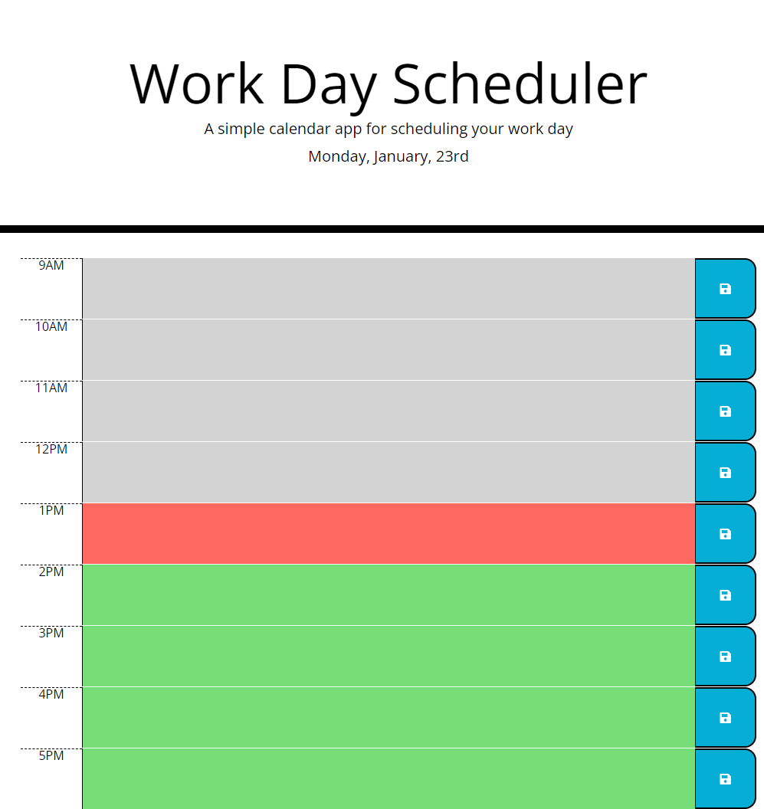

# Word Day Planner

## Description

I have made a JavaScript application with the use of third party API JQuery which sets out a dynamically generated page in HTML and takes classes to style them. The planner is so that the user may better organise their time and list their word day plan.

## Usage

When user types in one of the schedule hours and press the save button on the right side of the page, the text content is saved to local storage and retreived so that it stays in place for current user. The hours are highlighted in reference to current hour which is red, past hours which is grey and future hours which are green.

### Project Page

**Below is the attached link for the deployed application**

Click [here](https://alecerf01.github.io/work-day-planner/) to go to my page.

### Mock-Up

The following image shows the web application's appearance and functionality:

